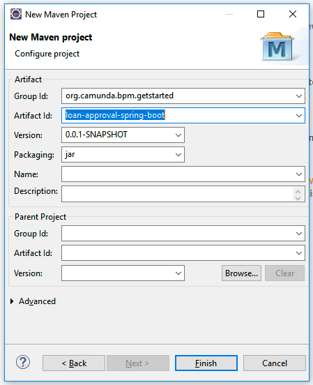
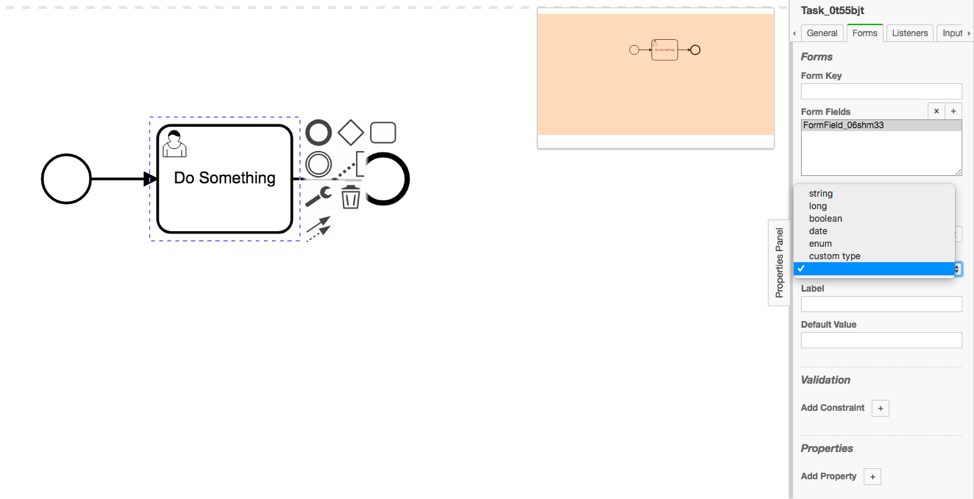
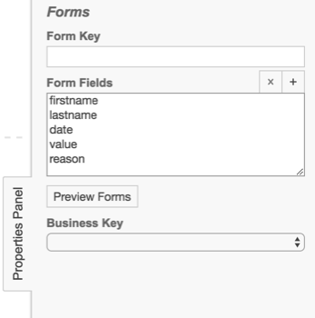
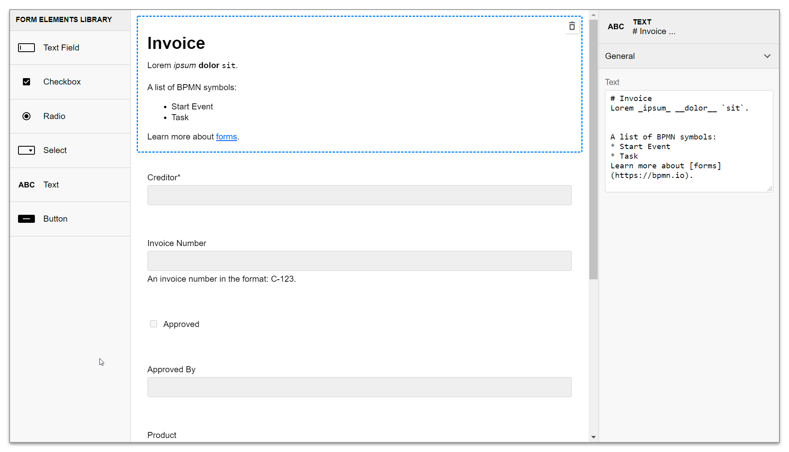
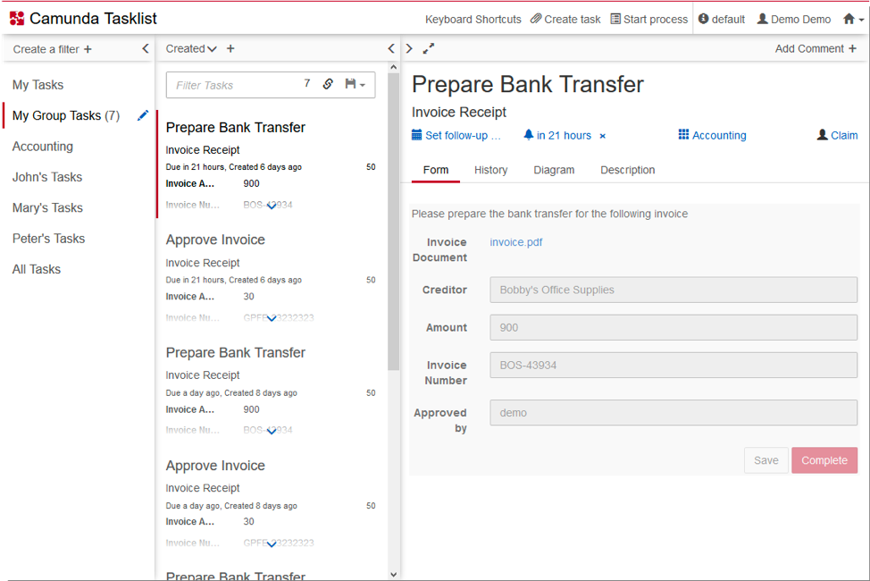

# Camunda Spring Boot
Esse projeto foi desenvolvido como parte de uma atividade da disciplina de Tópicos Avançados em Engenharia de Software do curso de Sistemas de Informação na Universidade de Pernambuco campus Caruaru


# Instalação do Camunda

1. Baixar o Camunda Community Edition no [site oficial](https://camunda.com/download/).
2. Inicar o Camunda executando `start.bat` (Windows) ou `start.sh` (Linux)
3. O camunda irá ficar disponível no endereço <http://localhost:8080/>


# Configurando o projeto java ( Spring Boot )

### Criar um projeto maven



### Adicionar as dependências do Camunda e do Spring Boot

```xml
<project xmlns="http://maven.apache.org/POM/4.0.0" xmlns:xsi="http://www.w3.org/2001/XMLSchema-instance" xsi:schemaLocation="http://maven.apache.org/POM/4.0.0 http://maven.apache.org/xsd/maven-4.0.0.xsd">
<modelVersion>4.0.0</modelVersion>
<groupId>org.camunda.bpm.getstarted</groupId>
<artifactId>loan-approval-spring-boot</artifactId>
<version>0.0.1-SNAPSHOT</version>

  <properties>
    <camunda.spring-boot.version>7.15.0</camunda.spring-boot.version>
    <spring-boot.version>2.4.4</spring-boot.version>
    <maven.compiler.source>1.8</maven.compiler.source>
    <maven.compiler.target>1.8</maven.compiler.target>
  </properties>

  <dependencyManagement>
    <dependencies>
      <dependency>
        <groupId>org.springframework.boot</groupId>
        <artifactId>spring-boot-dependencies</artifactId>
        <version>${spring-boot.version}</version>
        <type>pom</type>
        <scope>import</scope>
      </dependency>
    </dependencies>
  </dependencyManagement>

  <dependencies>
    <dependency>
      <groupId>org.camunda.bpm.springboot</groupId>
      <artifactId>camunda-bpm-spring-boot-starter-webapp</artifactId>
      <version>${camunda.spring-boot.version}</version>
    </dependency>
    <dependency>
      <groupId>com.h2database</groupId>
      <artifactId>h2</artifactId>
    </dependency>
    <dependency>
      <groupId>com.sun.xml.bind</groupId>
      <artifactId>jaxb-impl</artifactId>
      <version>2.2.3</version>
    </dependency>
  </dependencies>

   <build>
    <plugins>
      <plugin>
        <groupId>org.springframework.boot</groupId>
        <artifactId>spring-boot-maven-plugin</artifactId>
        <version>${spring-boot.version}</version>
        <configuration>
          <layout>ZIP</layout>
        </configuration>
        <executions>
          <execution>
            <goals>
              <goal>repackage</goal>
            </goals>
          </execution>
        </executions>
      </plugin>
    </plugins>
  </build>

</project>
```

### Criar a classe `Main` para a aplicação Spring Boot

```java
package org.camunda.bpm.getstarted.loanapproval;

import org.springframework.boot.SpringApplication;
import org.springframework.boot.autoconfigure.SpringBootApplication;

@SpringBootApplication
public class WebappExampleProcessApplication {
	public static void main(String... args) {
		SpringApplication.run(WebappExampleProcessApplication.class, args);
	}
}
```

# Conexão com o banco de dados (PostgresSQL)

### Criar uma pasta resources e dentro um arquivo chamado `application.yaml` com o seguinte conteudo

```yaml
camunda:
  admin-user:
    id: demo
    password: demo
  bpm:
    database:
      type: postgres
    table-prefix: camunda.
    schema-update: true

spring:
  main:
    allow-bean-definition-overriding: true
  jpa:
    properties:
      hibernate:
        dialect: org.hibernate.dialect.PostgreSQLDialect
  datasource:
    driverClassName: org.postgresql.Driver
    #DB connection:
    url: jdbc:postgresql://localhost:5432/postgres?stringtype=unspecified
    username: SEU_USUARIO
    password: SUA_SENHA
```

### Criação de Formulários

### Instalar o camunda modeler

### Crie um processo


#### Para cada user task é possível criar um formulário




### Os formulários poderão ser visualizados nas tasklist do camunda web




# Integração com serviço externo

### Criar uma classe que implementa a interface `JavaDelegate`

```java
package com.example.workflow;


import org.camunda.bpm.engine.delegate.DelegateExecution;
import org.camunda.bpm.engine.delegate.JavaDelegate;
import org.camunda.bpm.model.bpmn.BpmnModelInstance;
import sun.net.www.http.HttpClient;

import javax.inject.Named;
import java.io.OutputStream;
import java.net.HttpURLConnection;
import java.net.URL;
import java.net.URLConnection;
import java.nio.charset.StandardCharsets;
import java.util.Date;

@Named
public class ExternalWebServiceDeletage implements JavaDelegate {
    public void execute(DelegateExecution execution) throws Exception {
        System.out.println(execution.getCurrentActivityName());
        URL url = new URL("http://localhost:3000/logs");
        URLConnection con = url.openConnection();
        HttpURLConnection http = (HttpURLConnection)con;
        http.setRequestMethod("POST");
        http.setDoOutput(true);

        byte[] out = ("{\"form\":\"" + execution.getCurrentActivityName() + "\",\"date\":\"" + new Date() + "\"}").getBytes(StandardCharsets.UTF_8);
        int length = out.length;

        http.setFixedLengthStreamingMode(length);
        http.setRequestProperty("Content-Type", "application/json; charset=UTF-8");
        http.connect();
        try(OutputStream os = http.getOutputStream()) {
            os.write(out);
        }
    }
}

```


